# 🥬 VegeMarket

A modern grocery and vegetable e-commerce website built using the MERN Stack. The project features a clean Light Green theme with Apple's Liquid Glass UI design, making the shopping experience elegant, modern, and responsive.

---

# Features

- Modern Liquid Glass UI
- Responsive Design
- Product Categories
- Product Details Page
- Shopping Cart
- Wishlist
- Login & Register
- User Profile
- Checkout Page
- About Page
- Contact Page
- Search Products
- Beautiful Animations
- Mobile Friendly

---

# Categories

- Fruits
- Vegetables
- Nuts & Dates
- Bakery
- Dairy
- Pantry
- Frozen Food
- Baby Food
- Tea & Coffee
- Beverages
- Gift Basket

---

# Tech Stack

## Frontend

- React.js
- Vite
- Tailwind CSS
- React Router DOM
- React Icons
- Framer Motion

## Backend (Future Integration)

- Node.js
- Express.js
- MongoDB
- Mongoose
- JWT Authentication

---

# Folder Structure

```
vegemarket
│
├── src
│   ├── components
│   ├── pages
│   ├── data
│   ├── assets
│   ├── App.jsx
│   └── main.jsx
│
├── public
├── package.json
├── vite.config.js
├── tailwind.config.js
└── README.md
```

---

# Installation

Clone the repository

```bash
git clone <repository-url>
```

Go inside project

```bash
cd vegemarket
```

Install dependencies

```bash
npm install
```

Start development server

```bash
npm run dev
```

Build project

```bash
npm run build
```

---

# Future Backend Integration

The frontend is designed to work with a MERN backend.

Backend will provide:

- Authentication
- Products API
- Categories API
- Orders API
- Cart API
- Wishlist API
- Payment API
- Admin Dashboard

---

# Design

Theme

- Light Green
- White
- Glass Morphism
- Liquid Glass Effects
- Rounded Components
- Smooth Animations

---


# Screenshots Preview

## Home

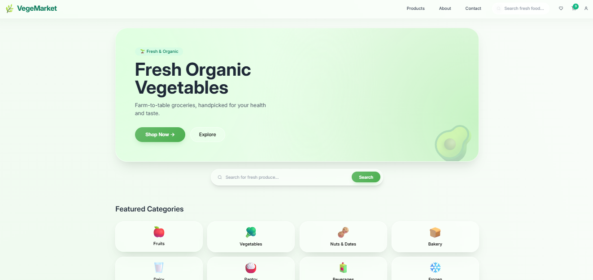

## Products

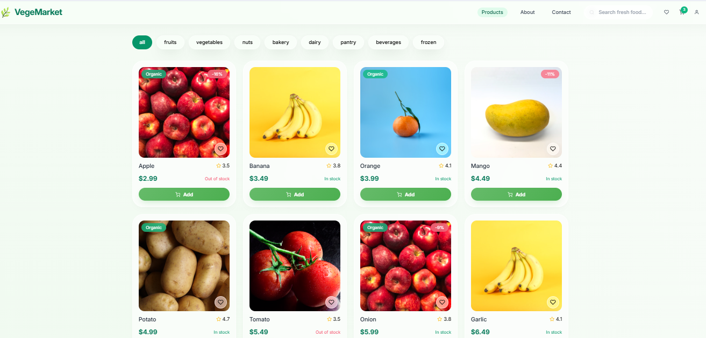

## Product Detail

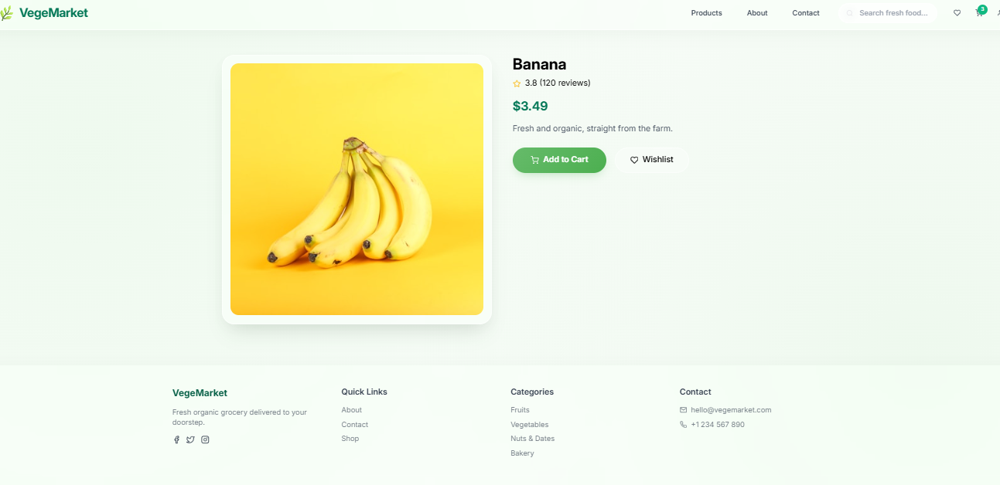

## Cart

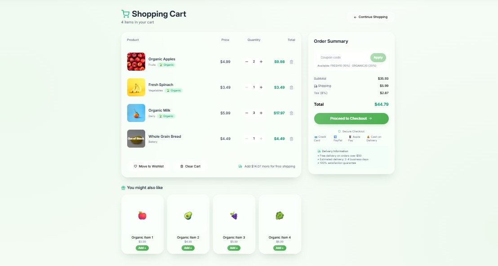

## Wishlist

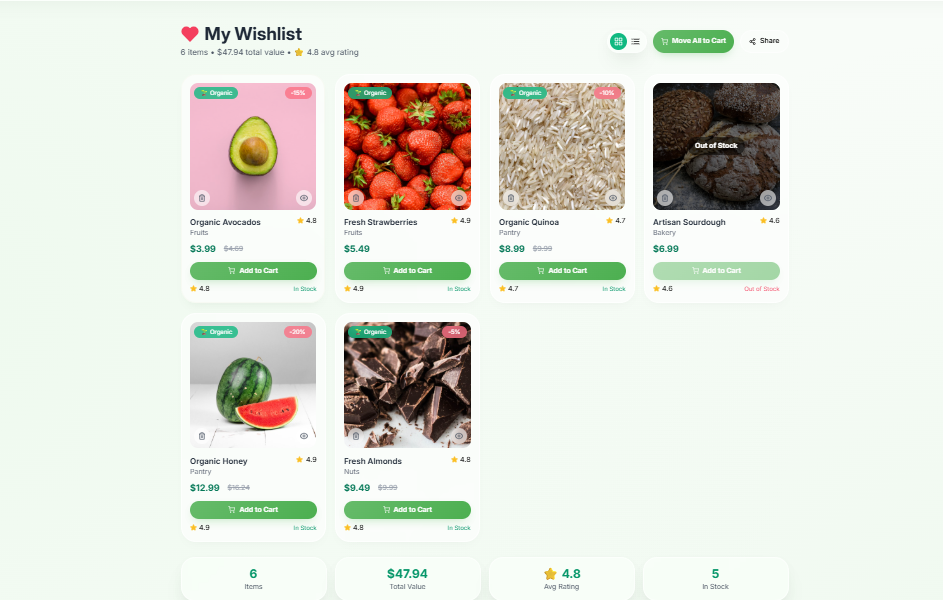

## Checkout

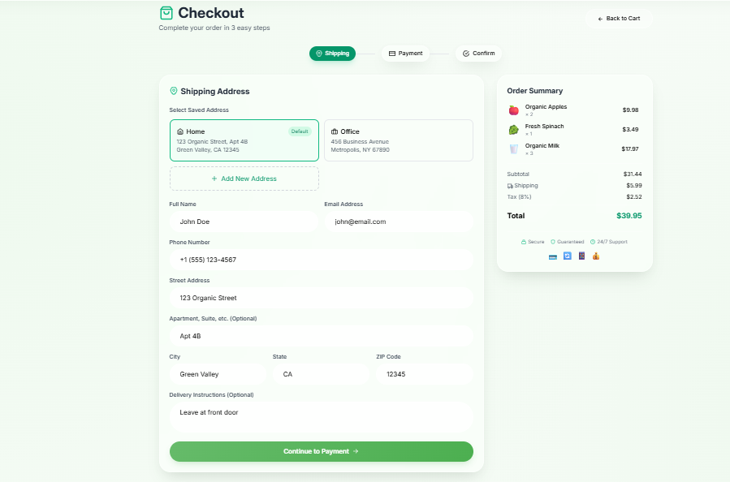
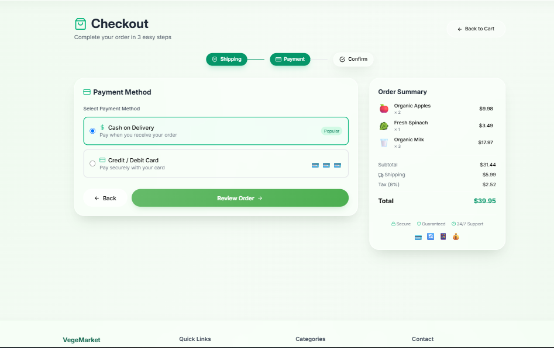
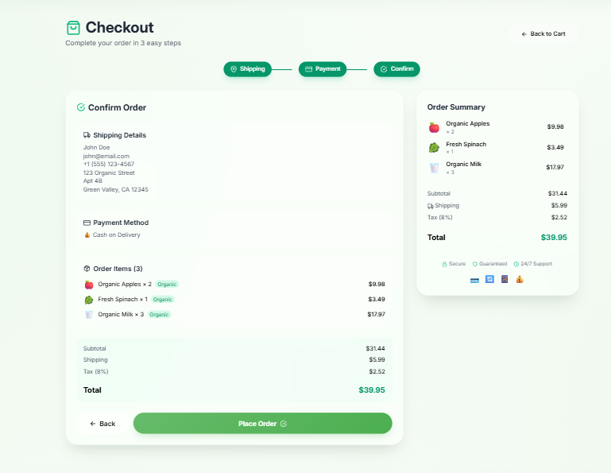
## Login

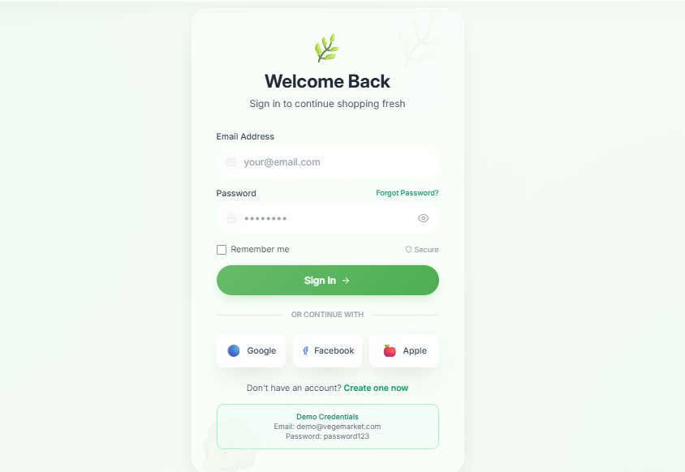

## Register

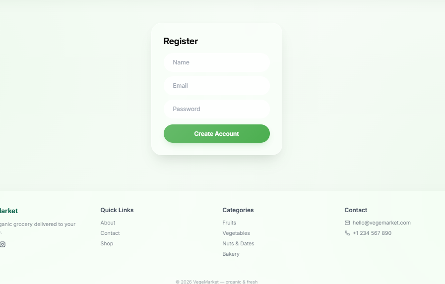

## About

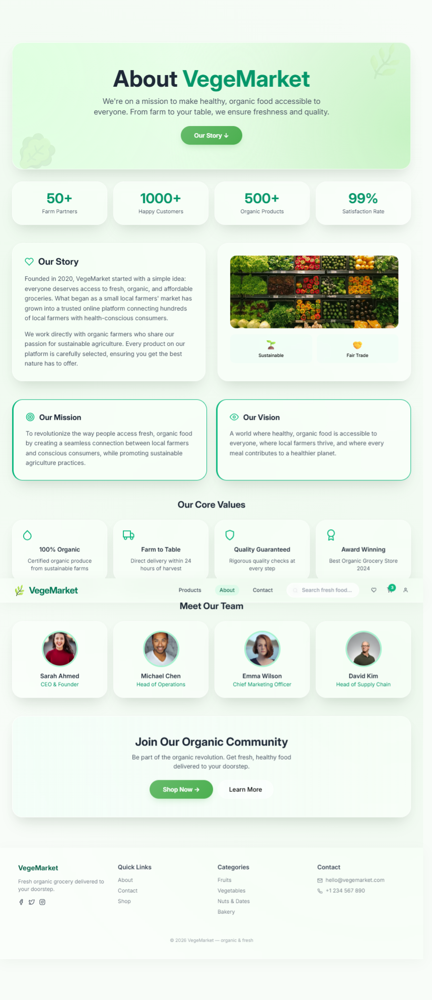

## Contact

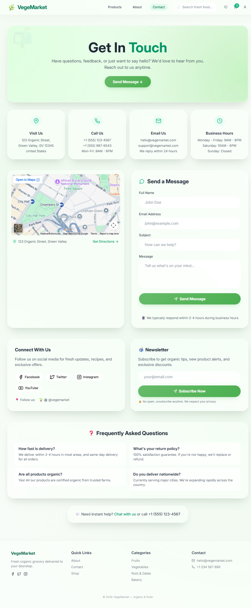

---

# Future Improvements

- Payment Gateway
- Admin Dashboard
- Product Reviews
- Coupons
- Email Notifications
- Order Tracking
- Inventory Management
- Dark Mode

---

# Author

Rahim Ahmed
